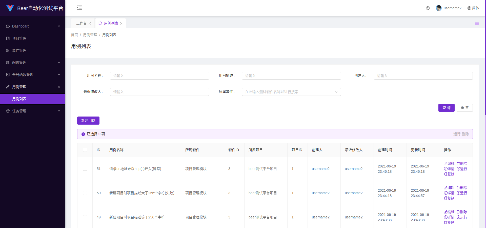

# Beer接口自动化测试平台(单机版项目)
## 预览

## 使用到的技术栈
### 前端
   * [Vue.js](https://cn.vuejs.org/v2/guide/) JavaScript框架
   * [Vuex](https://vuex.vuejs.org/zh/guide/) 数据集中式存储；跨组件通信
   * [Vue Router](https://router.vuejs.org/zh/) Vue.js 官方的路由管理器。 
   * [Ant Design of Vue](https://antdv.com/docs/vue/introduce-cn/) UI组件库
   * [G2Plot](https://g2plot.antv.vision/zh) 开箱即用的图表库
   * [axios](https://github.com/axios/axios) 易用、简洁且高效的基于Promise的http库
   * [Monaco Editor](https://microsoft.github.io/monaco-editor/) 实现在线编辑器功能，在线编辑Python代码以及渲染JSON
### 后端
   * [Django](https://docs.djangoproject.com/zh-hans/3.2/) Python Web 框架
   * [Django REST framework](https://www.django-rest-framework.org/) 基于Django构建restful风格的API
   * [djangorestframework-simplejwt](https://github.com/jazzband/djangorestframework-simplejwt) 用于Django REST framework的JSON Web令牌身份验证插件
   * [drf-spectacular](https://github.com/tfranzel/drf-spectacular) 生成在线swagger和redoc形式的API文档
   * [Celery](https://docs.celeryproject.org/en/stable/) 实现异步任务队列功能
   * [django-celery-results](https://django-celery-results.readthedocs.io/en/latest/) 使用Django ORM存储Celery任务执行结果 
   * [django-cors-headers](https://github.com/adamchainz/django-cors-headers) 后端配置CORS解决跨域问题
   * [django-grappelli](https://django-grappelli.readthedocs.io/en/latest/) Django自带admin后台的主题美化插件
   * [Gunicorn](https://gunicorn.org/) 用于生产环境部署Django项目的Python WSGI HTTP Server
   * [jmespath](https://github.com/jmespath/jmespath.py) 用于JSON查询的语言，实现接口自动化测试中的响应体结果的提取
   * [Mysql](https://www.mysql.com/cn/) 项目数据持久化存储
   * [RabbitMQ](https://www.rabbitmq.com/) 用于Celery异步任务队列的消息中间件
   * [Requests](https://docs.python-requests.org/en/master/) 使用Python发起HTTP请求
   * [Nginx](https://nginx.org/en/) Web和反向代理服务器
   * [Docker](https://docs.docker.com/) 容器化部署前后端应用
   * [Docker Compose](https://docs.docker.com/compose/) 容器编排工具，实现一键部署项目
#### 特别鸣谢以上开源项目，让我得以站在巨人的肩膀上快速构建自己的项目。
## 部署(生产环境)
1. 安装docker和docker-compose和git
    * [docker安装步骤(官方文档)](https://docs.docker.com/engine/install/)
    * [docker-compose安装步骤(官方文档)](https://docs.docker.com/compose/install/)
    * [git安装步骤(官方文档)](https://git-scm.com/download/linux)
2. git拉取本项目代码到服务器
    ```bash
    git clone https://github.com/passerby223/beer_server.git
    ```
3. 进入项目`compose/server`目录
    * 创建部署所需要的配置文件`config.ini`
        ```bash
        cd beer_server/compose
        # 没有vim的话，可以使用vi命令
        vim config.ini
        ```
    * 添加如下内容到配置文件`config.ini`，然后`:wq`保存
        ```ini
        [email]
        # 管理员邮箱 多个管理员以` # `分隔；每组管理员的信息以`,`分隔, 前边是管理员名称,后边是管理员邮箱地址
        ADMINS = anonymous,xxx@189.cn # passerby233,xxx@gmail.com
        # 管理员账户密码
        ADMINS_PASSWORD = admin.191215.*
        # 系统邮箱的smtp配置
        EMAIL_HOST = smtp.163.com
        EMAIL_PORT = 465
        EMAIL_HOST_USER = xxxx@163.com
        # IMAP/SMTP服务 或 POP3/SMTP服务 的密码
        EMAIL_HOST_PASSWORD = KIBGJJSEXYHPARVE
        # 异步测试任务执行完成后，给任务创建者发送邮件时使用
        # development
        ;FE_TASK_DETAIL_BASEURL = http://localhost:8080/#/tasks/detail/
        # production
        FE_TASK_DETAIL_BASEURL = http://部署nginx所在服务器的域名或IP/#/tasks/detail/
        
        [secret_key]
        SECRET_KEY = v3fe8wwf94y4mo189syst4#2*ge1*8qx)!@*4%%x1$+ts*d^^cg
        [deploy]
        # development
        ;DEBUG = True
        # production,生产环境需要把DEBUG设置为False
        DEBUG = False
        [database]
        # 测试环境数据库配置 development
        ;ENGINE = django.db.backends.mysql
        ;HOST = 127.0.0.1
        ;PORT = 3306
        ;NAME = beer
        ;USER = root
        ;PASSWORD = 123123
        # 生产环境数据库配置 production
        # 如果在此处修改了数据库密码，则需要去项目根目录下的docker-compose.yml中同步修改数据库密码(MYSQL_ROOT_PASSWORD字段的值要与此处的密码一致，默认是mysql.196652.*)
        ENGINE = django.db.backends.mysql
        HOST = mysql
        PORT = 3306
        NAME = beer
        USER = root
        PASSWORD = mysql.196652.*
        ```
4. 进入`compose/frontend`目录
    * 修改`.env.production`文件中的`VUE_APP_PRO_API_BASE_URL`为自己的`服务器域名或IP`
        ```bash
        VUE_APP_PRO_API_BASE_URL=http://服务器域名或者IP/api 
        ```
5. 然后回到项目根目录，使用docker-compose命令一键部署项目
    ```bash
    cd ../../
    # 一键部署(docker会自动创建镜像并运行容器, 前端代码也是在镜像构建阶段进行编译的)
    docker-compose up -d
    ```
6. 等待docker-compose创建镜像完毕后，会自动运行容器。
    ```bash
    # 查看容器是否均启动完毕
    w@server:~/beer_server# docker-compose ps
      Name                Command               State                                                                   Ports                                                                 
    ------------------------------------------------------------------------------------------------------------------------------------------------------------------------------------------
    backend    /bin/sh -c /bin/bash deplo ...   Up      0.0.0.0:8000->8000/tcp,:::8000->8000/tcp                                                                                              
    mysql      docker-entrypoint.sh --def ...   Up      0.0.0.0:3306->3306/tcp,:::3306->3306/tcp, 33060/tcp                                                                                   
    nginx      /bin/sh -c /bin/bash deplo ...   Up      0.0.0.0:443->443/tcp,:::443->443/tcp, 0.0.0.0:80->80/tcp,:::80->80/tcp                                                                
    rabbitmq   docker-entrypoint.sh rabbi ...   Up      15671/tcp, 0.0.0.0:15672->15672/tcp,:::15672->15672/tcp, 15691/tcp, 15692/tcp, 25672/tcp, 4369/tcp, 5671/tcp, 0.0.0.0:5672->5672/tcp,:::5672->5672/tcp
    # 删除使用docker-compose构建镜像过程中产生的repository或tag为none的无用镜像文件
    w@server:~/beer_server# docker images | grep none | awk '{print $3}' | xargs docker rmi
    Deleted: sha256:18e173792b9d00fb0b0fcaffc2bb9040a4125d87925527ba7ce4d3436ee3bb4c
    Deleted: sha256:c4935261a16b1048a747ef2791e072e47f90452aa979feff8d695449f26ff6ab
    Deleted: sha256:5ae67ef04ad1a2ae5b3d866f71fe5a5c6214e8c6f7e728cb12183781d6bf9d68
    Deleted: sha256:9d948dfd0658ba38a80f26833c492552004191cbd7fad4536bdfb033b4ee21c8
    Deleted: sha256:6865f17ee8b6b3008df5d9dfb6f2aeba440b7ade88539ba035f57163890c644f
    ```
7. 此时项目已经部署完毕
    * `前端页面`和`admin管理后台页面`登录时默认的`账户名`是`config.ini`配置文件中的`ADMINS`配置的`管理员账户`。`账户名`使用`邮箱地址`或`用户名`均可以。`密码`默认`admin.191215.*`
    * 浏览器访问`http://服务器域名或IP/`(默认80端口)即可查看项目前端页面
    * 浏览器访问`http://服务器域名或IP/admin/`(默认80端口)即可查看项目admin管理后台页面
    * 浏览器访问`http://服务器域名或IP/api/schema/redoc/`(默认80端口)即可查看项目redoc形式的接口文档
    * 浏览器访问`http://服务器域名或IP/api/schema/swagger-ui/`(默认80端口)即可查看项目swagger形式的接口文档
## 开发(测试环境)
### 前端开发
1. `compose/frontend`目录下的代码就是前端本地开发所需要的代码
    ```bash
    ## Project setup
    yarn install
    
    ### Compiles and hot-reloads for development
    yarn serve
    
    ### Compiles and minifies for production
    yarn build
    
    ### Lints and fixes files
    yarn lint
    ```
### 后端开发
1. 在`compose/server`目录下的`config.ini`配置文件中修改测试环境所需要的环境配置(`数据库`需要自己手动创建)
2. 返回到项目`根目录`安装`项目依赖库`，然后进行`数据迁移`(会自动在上一步中创建的数据库中创建开发所需要的数据表)
    ```bash
    # 返回项目根目录
    cd .../../
    # 安装项目依赖库
    pip3 install -i https://pypi.doubanio.com/simple -U pip && pip3 install -i https://pypi.doubanio.com/simple -r requirements.txt
    # 创建迁移记录
    python3 manage.py makemigrations
    # 数据迁移(创建数据库表)
    python3 manage.py migrate
    ```
3. 初始化项目管理员账户
    ```bash
    # 使用`init_admin`命令初始化`config.ini`配置文件中的`ADMINS`配置的`管理员账户`
    python3 manage.py init_admin
    # 或者使用Django自带的``命令
    python3 manage.py createsuperuser
    ```
4. 更新全局函数文件内容(可选操作，用于`接口入参`中使用`函数运算功能`)
    ```bash
    python3 manage.py update_global_function_content
    ```
5. 启动开发服务器进行测试
    ```bash
    python3 manage.py runserver
    ```
6. 测试环境使用Celery异步任务队列功能(用于`异步`运行`测试项目`&`测试套件`，本项目中的`单个测试用例`不是异步运行的)
    ```bash
    # 创建rabbitmq容器
    docker run -d --name ramq -p 5672:5672 -p 15672:15672 rabbitmq && docker ps
    # 启动容器(容器关闭状态可用)
    docker start ramq
    # 启动Celery服务(在项目manage.py文件同级目录下用该命令启动)
    celery -A beer_server worker -l INFO
    ```
7. 跨域问题
    * `后端测试环境`默认配置了`CORS`来避免`跨域`，`前端测试环境`不需要在`单独配置代理`来解决`跨域`问题了。
    * `生产环境`默认使用了`nginx`的`反向代理`来解决`跨域`问题
8. 后端在线接口文档(启动开发服务器后)
    * 浏览器访问 [http://127.0.0.1:8000/api/schema/redoc/](http://127.0.0.1:8000/api/schema/redoc/) 查看`redoc`格式的接口文档
    * 浏览器访问 [http://127.0.0.1:8000/api/schema/swagger-ui/](http://127.0.0.1:8000/api/schema/swagger-ui/) 查看`swagger`格式的接口文档
