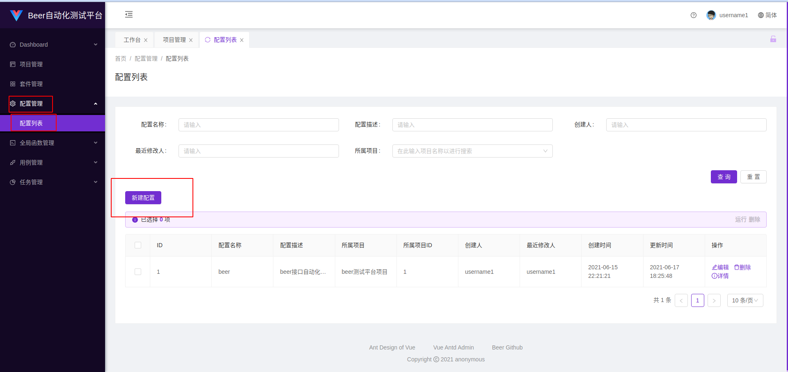
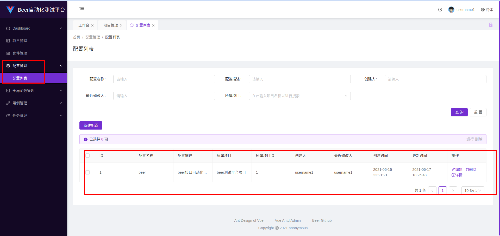
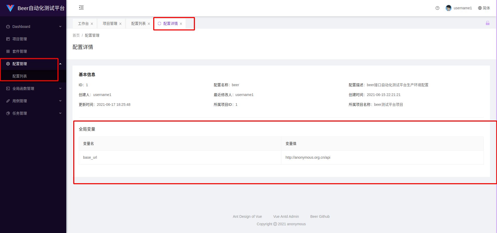
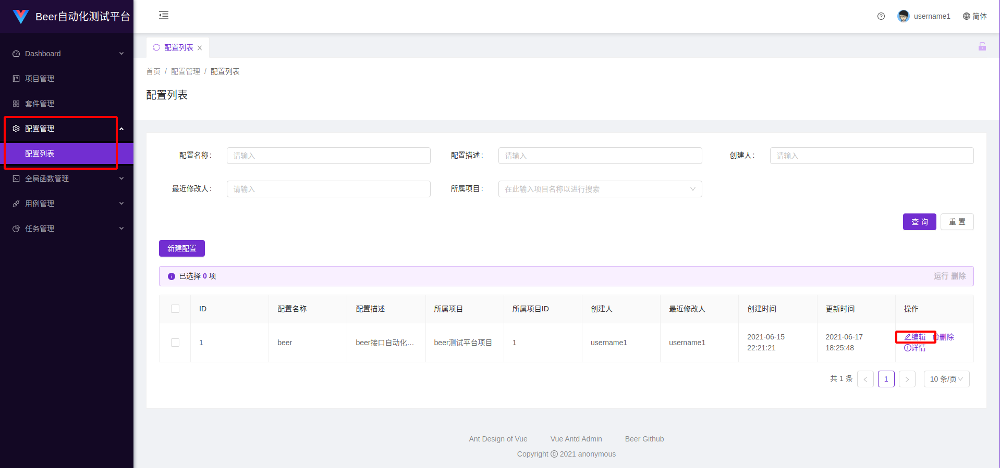
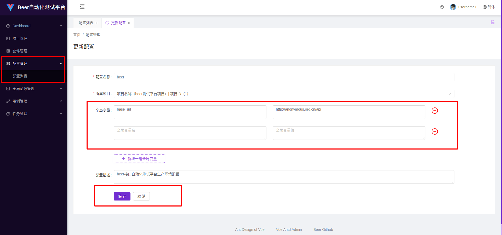
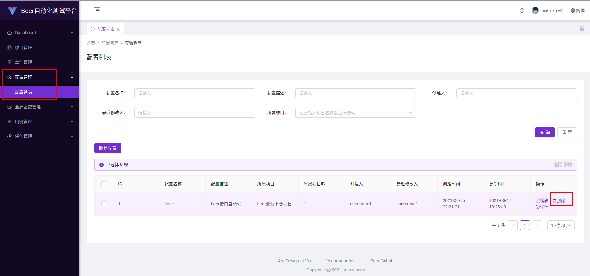
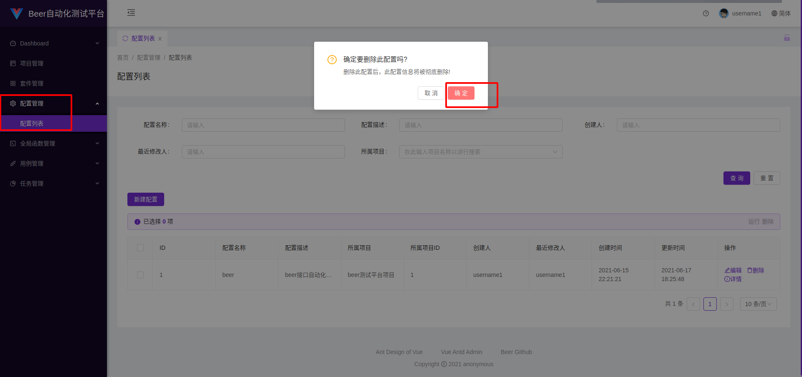

# 配置管理
## 图片看不清楚可以右键在新标签页打开图片就可以看清楚了
## 新增配置

可以在`测试用例`中的`测试步骤`的`请求URL地址`，`json参数`，`查询字符串参数`，`x-www-form-urlencoded参数`，`请求头参数`，`cookies参数`中使用`$全局变量名`的方式来使用全局变量。运行用例时，系统后台会自动解析以上`测试步骤`中的`请求参数`中引用了`全局变量`的`参数`，然后将`测试步骤请求参数`中的`$全局变量名`替换为对应的`全局变量值`。具体使用详情请查看测试用例管理模块用户文档。

## 查看全局配置

配置列表查看简略信息

全局配置详情页面查看配置详情

## 修改全局配置

## 删除全局配置

