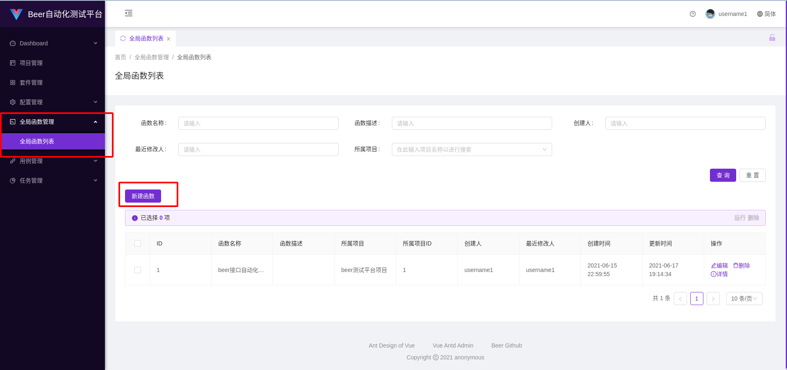
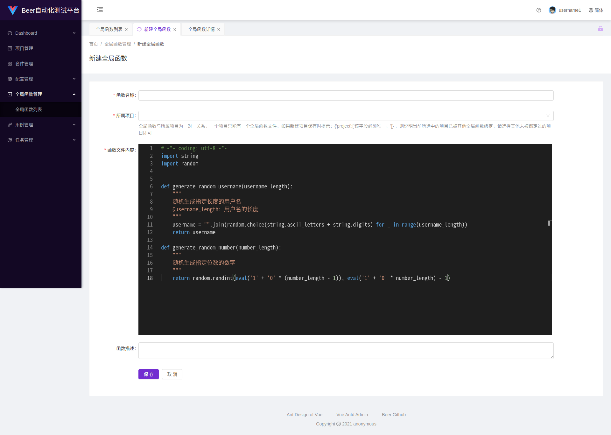
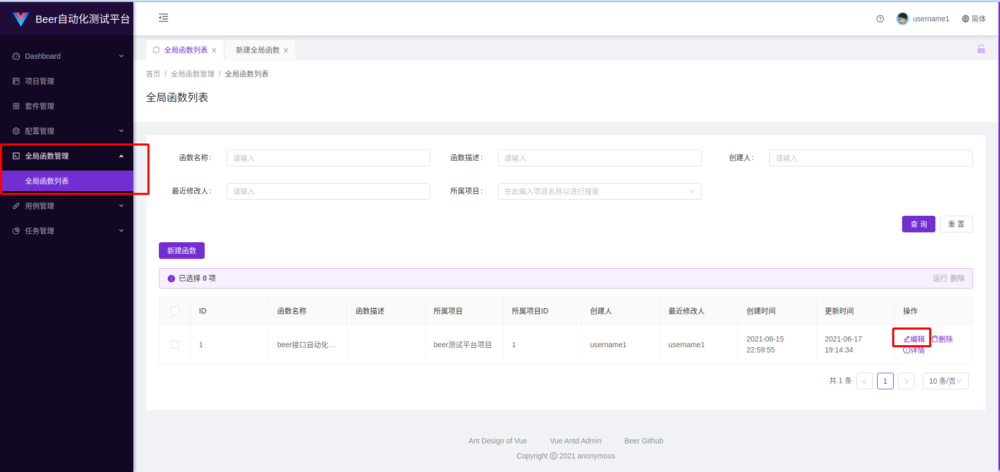
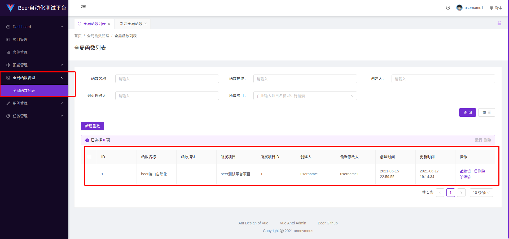
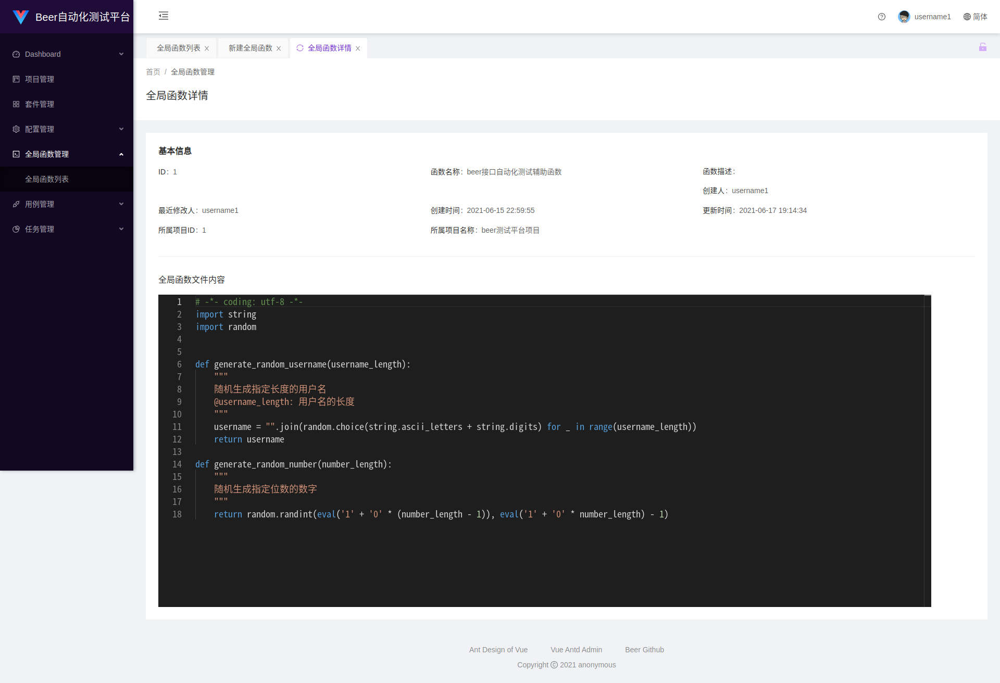
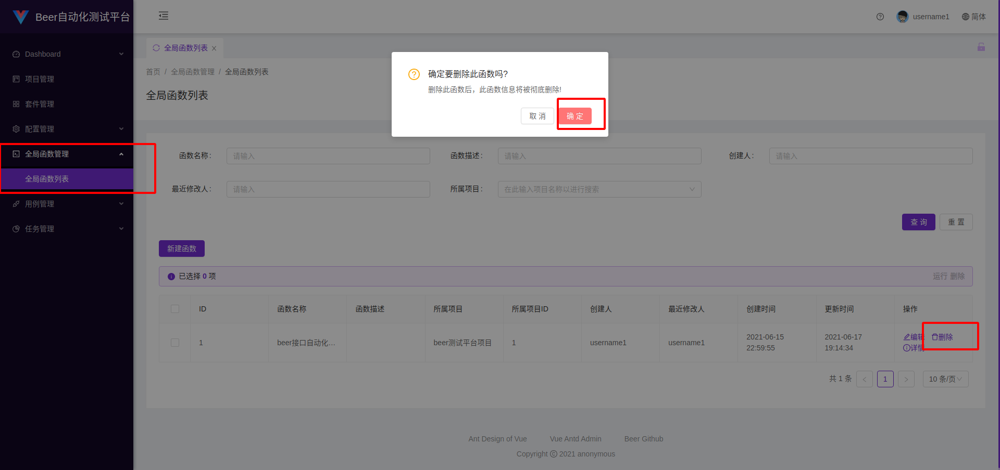

# 全局函数管理
## 图片看不清楚可以右键在新标签页打开图片就可以看清楚了
## 新增全局函数

可以在`测试用例`中的`测试步骤`的`请求URL地址`，`json参数`，`查询字符串参数`，`x-www-form-urlencoded参数`，`请求头参数`，`cookies参数`中使用`${全局函数名(参数)}`的方式来使用`全局函数`。运行用例时，系统后台会自动解析以上`测试步骤`中的`请求参数`中引用了`全局函数`的`参数`，然后将`测试步骤请求参数`中的`${全局函数名(参数)}`替换为对应的`函数运行后的返回值`。具体使用详情请查看测试用例管理模块用户文档。

### 使用全局函数需要注意的点

1. 如果测试步骤某个入参字段为`age`，`函数返回值`为`数字类型`，此`age`参数在用例运行时会被解析为`数字类型，如：整数21或浮点数21.5`

2. 如果测试步骤某个入参字段为`username`，`函数返回值`为`字符串类型`，此`username`参数在用例运行时会被解析为`字符串类型，如："小米糕"`

3. 如果测试步骤某个入参字段为`deleted`，`函数返回值`为`boolean类型`，此`deleted`参数在用例运行时会被解析为`boolean类型，如：true`

4. 其他函数返回值类型，如`列表List`，`元组Tuple`，`集合Set`，`对象Object`，`字典dict`等等数据类型，会被统一转化为`字符串类型`

5. 最后一点需要注意的是，`测试步骤入参字段`中如果使用了`全局函数`，`全局函数的返回值为非字符串格式`，该`入参字段的值`需要是`非字符串类型`，只能是`${全局函数名(参数)}`，不能包含其他内容，如果填写方式为`qqq${全局函数名(参数)}haha`，则此`参数`在`用例运行时`会被`解析`为`字符串格式`。

## 编辑全局函数

## 查看全局函数

### 查看全局函数简略信息

### 查看全局函数详情

## 删除全局函数

