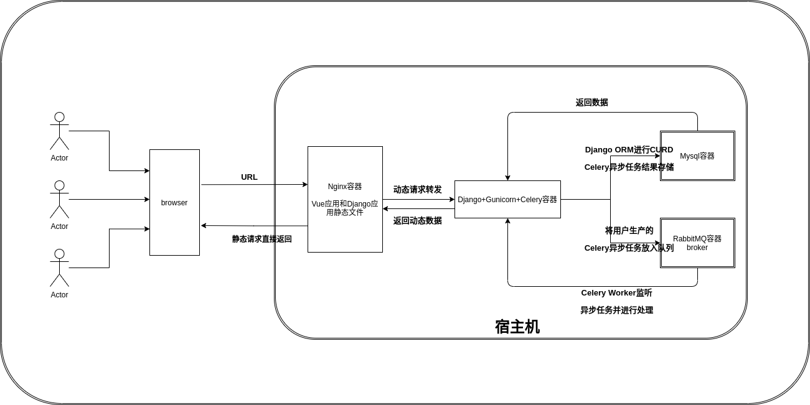

# 项目介绍
## 项目架构
项目部署完成后，项目的架构图如下所示


## 代码目录结构
### 前端代码目录结构
前端代码位于项目根目录下的`compose/frontend/`目录下
```bash
(venv) w@w-Vulcan-Series:~$ tree -I "node_modules" -L 2
.
├── babel.config.js                         ES6转ES5以前语法的babel插件配置文件
├── deploy_nginx.sh                         docker部署前端项目时需要使用到的shell脚本
├── Dockerfile                              docker部署前端项目时的dockerfile文件
├── LICENSE                                 前端项目开源协议
├── nginx.conf                              docker部署前端项目时的使用nginx托管静态文件，nginx的配置文件
├── nginx_logs                              前端项目部署后，nginx日志存放的位置
├── package.json                            前端项目依赖配置文件
├── .prettierrc.js                          代码格式统一规范Prettier配置文件
├── .gitignore                              git提交时的忽略文件清单
├── .eslintrc.js                            ESlint配置文件
├── .env                                    前端项目测试环境和生产环境都需要加载的环境变量文件
├── .env.development                        前端项目只在测试环境需要加载的环境变量文件
├── .env.production                         前端项目只在生产环境需要加载的环境变量文件
├── .dockerignore                           使用docker构建前端项目时不需要复制到镜像中的清单文件
├── .browserslistrc                         浏览器兼容配置文件
├── public
│   ├── favicon.ico                         favicon
│   └── index.html                          入口 HTML
├── README.md                               前端项目自述文档
├── src                                     源代码目录
│   ├── App.vue                             应用入口组件
│   ├── assets                              本地静态资源
│   ├── bootstrap.js                        应用启动引导js
│   ├── components                          内置通用组件
│   ├── config                              系统配置
│   ├── layouts                             通用布局
│   ├── main.js                             应用入口js
│   ├── plugins                             vue 插件
│   ├── router                              路由配置
│   ├── services                            数据服务模块
│   ├── store                               vuex 状态管理配置
│   ├── theme                               主题相关
│   ├── utils                               js 工具
│   └── views                               页面组件和通用模板
├── vue.config.js                           vue 配置文件
└── yarn.lock

14 directories, 14 files
```
### 后端代码目录结构
后端代码位于项目根目录下
```bash
(venv) w@w-Vulcan-Series:~$ tree -I "venv|migrations|__pycache__|node_modules" -L 2
.
├── .github                                            github action配置文件
├── apps                                            django项目app
│   ├── config                                      配置管理app
│   ├── functions                                   全局函数管理app
│   ├── group                                       用户组管理app
│   ├── __init__.py
│   ├── project                                     项目管理app
│   ├── task                                        测试任务管理app
│   ├── testcase                                    测试用例管理app
│   ├── testsuite                                   测试套件管理app
│   └── user                                        用户管理app
├── beer_server                                     后端项目配置文件相关
│   ├── asgi.py                                     以ASGI方式启动后端项目的入口文件
│   ├── celery.py                                   异步任务队列Celery配置文件
│   ├── __init__.py
│   ├── settings.py                                 后端项目配置文件
│   ├── urls.py                                     后端项目路由配置总入口
│   └── wsgi.py                                     以WSGI方式启动后端项目的入口文件                                     
├── compose                                         docker-compose部署整个项目中的配置文件目录
│   ├── frontend                                    前端项目源代码目录
│   ├── mysql                                       docker部署MySQL数据库时，数据库数据持久化到本目录
│   ├── rabbitmq                                    docker部署RabbitMQ时，rabbitmq数据持久化到本目录
│   └── server                                      docker部署后端项目时，数据持久化的保存数据的目录
├── deploy_server.sh                                docker部署后端项目时需要使用的shell脚本
├── docker-compose.yml                              docker-compose配置文件
├── Dockerfile                                      docker部署后端项目时的dockerfile文件
├── docs                                            本项目用户文档目录
│   ├── global-config.md
│   ├── global-func.md
│   ├── project-introduction.md
│   ├── project.md
│   ├── README.md
│   ├── testcase.md
│   ├── testsuite.md
│   ├── test-task.md
│   └── user-permission.md
├── global_funcs                                    全局函数执行时需要从本目录中导入全局函数，然后在执行对应的函数，本目录中的全局函数文件均来自于数据库
│   ├── func_script_project2.py
│   └── __init__.py
├── LICENSE                                         后端项目开源协议
├── logs                                            后端项目日志保存目录，如果不存在，项目运行时会自动创建改目录
│   ├── django-application.log                      后端项目django的日志
│   └── gunicorn.log                                wsgi服务器gunicorn的日志
├── manage.py                                       后端项目入口文件
├── media                                           用户媒体文件目录
│   └── images                                      用户上传的头像文件
├── .dockerignore                                   docker部署后端项目时不需要拷贝至镜像中的文件清单
├── .gitignore                                      git提交时不需要提交到git仓库的文件
├── package.json                                    用户文档使用vuepress来驱动，此文件是vuepress的依赖配置文件
├── README.md                                       后端项目自述文件
├── requirements.txt                                后端项目依赖清单文件
├── user-documentation-imgs                         用户文档中的图片
│   ├── caselist.png
│   ├── global-config
│   ├── global-func
│   ├── project
│   ├── testcase
│   ├── testsuite
│   ├── test-task
│   └── user-permission
├── utils                                           后端项目的工具类文件所在目录
│   ├── django_utils                                django相关的工具类
│   ├── drf_utils                                   django rest framework 相关的工具类
│   ├── http_utils                                  发起接口请求相关的工具类
│   └── __init__.py
└── yarn.lock

32 directories, 31 files
```