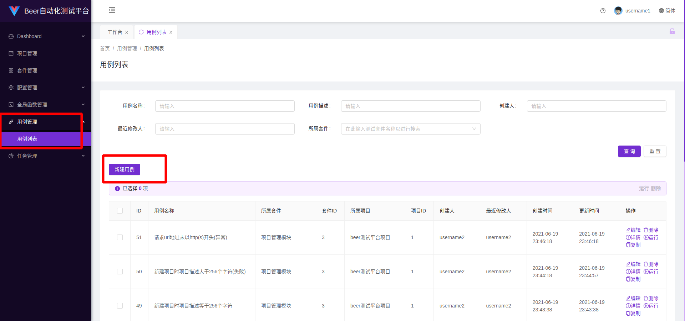
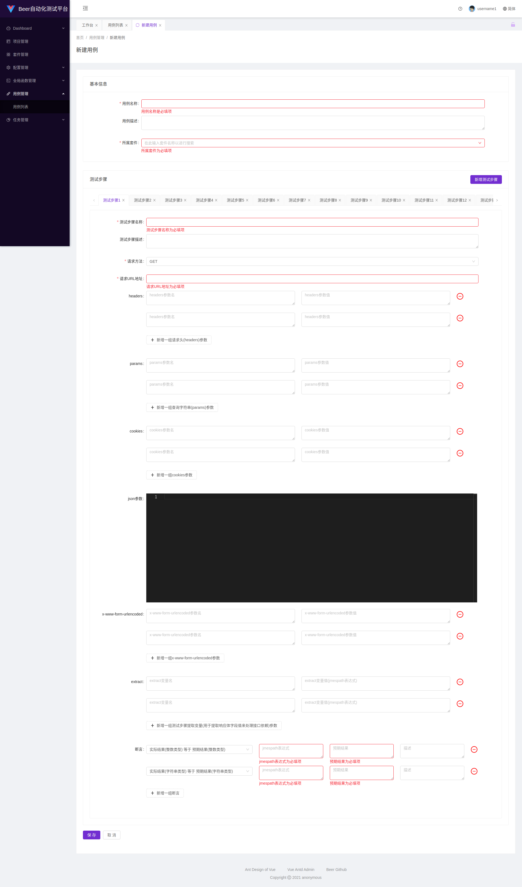
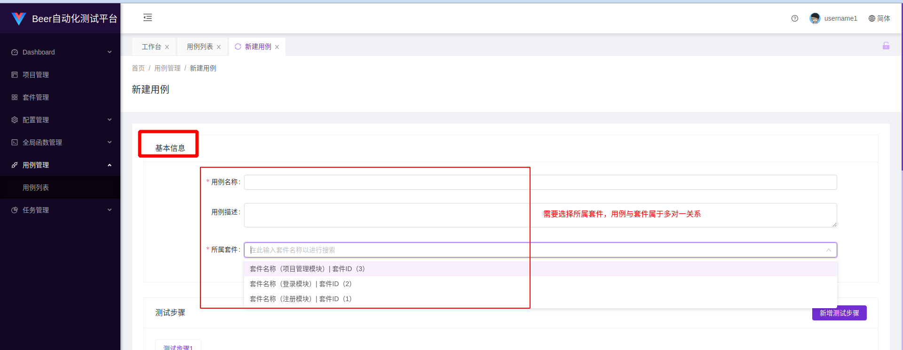
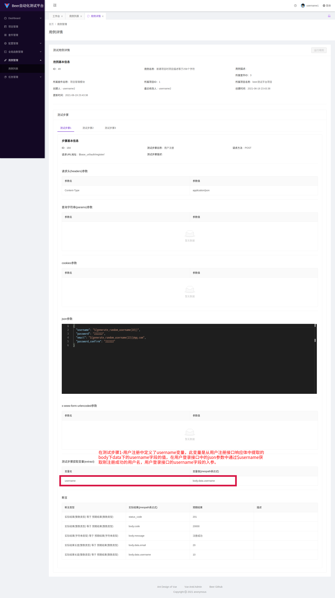
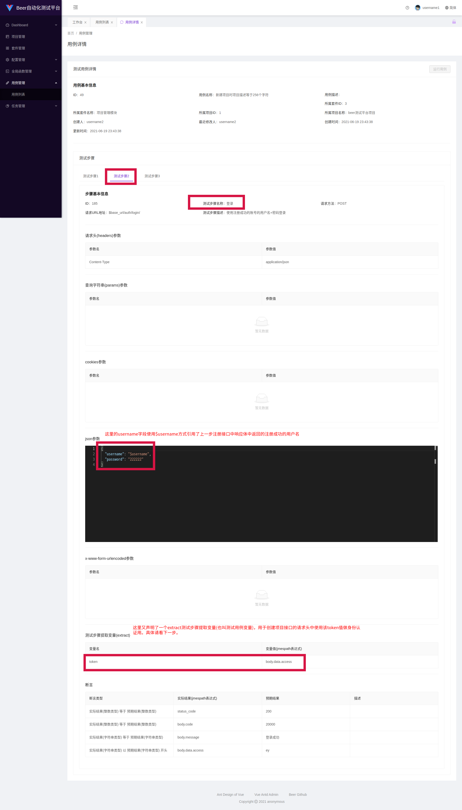
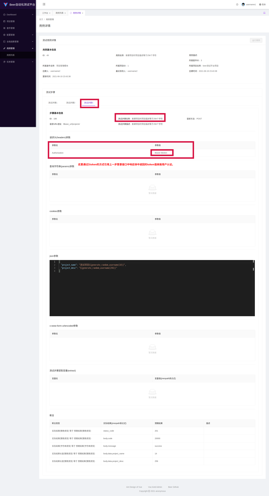
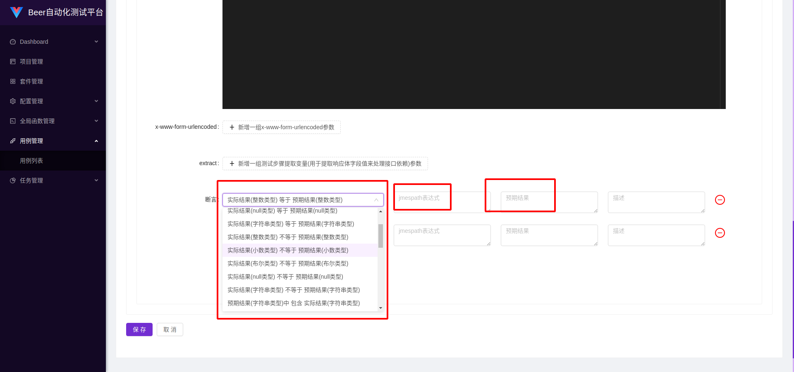

[toc]
# 测试用例管理
## 图片看不清楚可以右键在新标签页打开图片就可以看清楚了
## 新建测试用例





## 用例基本信息



## 测试步骤

每条测试用例都是可以单独运行的，每条测试用例包含多个测试步骤，每个测试部步骤对应一个接口请求。

每个测试步骤包含`测试步骤名称`，`测试步骤描述`，`请求方法`，`请求的URL地址`，`请求头参数`，`查询字符串参数`，`cookies参数`，`json格式参数`，`x-www-form-urlencoded`，`测试步骤提取变量(此变量也称为测试用例变量，测试用例变量的优先级大于全局配置中配置的全局变量)`，`断言`这11个元素。接下来详细介绍，每个元素的使用方法。

## 测试步骤名称

就是该测试步骤的名称。

## 测试步骤描述

就是该测试步骤的描述

## 请求方法

此字段对应http接口请求中的请求方法，此字段为`枚举类型`，目前只支持`GET`，`POST`，`PUT`，`PATCH`，`DELETE`这5种请求方法。

## 请求URL地址

此字段对应http请求中的URL地址。

* 可以填写完整的URL地址，如`http(s)://www.baidu.com/api`

* 可以在URL地址中使用变量，包括`全局变量`和`测试用例变量`，通过`$变量名`对`全局变量`或`测试用例变量`进行引用。

  * 全局变量：比如在**该用例所在的项目中**的**全局配置**中创建了一个key为`base_url`value为`http://www.baidu.com/api` 的全局变量，此处的URL就可以写成`$base_url/auth/register/` ，等到运行该用例时，后台会自动将`$base_url`替换为全局变量对应的值，此处在运行测试用例时，该测试步骤的`请求URL地址`就会由`$base_url/auth/register/` 被替换为 `http://www.baidu.com/api/auth/register/`

  * 测试用例变量：比如现在有一个测试用例中有3个测试步骤，测试步骤1为`登录`，测试步骤2为`运行项目(后台异步任务接口)`，测试步骤3为`查看测试任务运行详情`。测试步骤3的`请求URL`中有一个`路径参数`，该`路径参数`依赖于`运行项目接口`返回的`响应体`中的`任务ID字段的值`。此时就可以在测试步骤2中设置`extract(测试步骤提取变量)`，比如设置变量名为`taskId`，变量值为`body.data.id(此写法属于jmespath表达式形式，用于从响应体中提取字段值来处理接口依赖，详情请看接口依赖部分介绍)`，然后就可以在测试步骤3中的URL中使用该测试用例变量，如`$base_url/tasks/$taskId/` ，然后运行该测试用例时，测试步骤3的URL就会被替换为`http://www.baidu.com/api/tasks/4bc8c4cf-4731-459b-aa6c-e9405d17c517/` ，其中`$base_url`被替换为`http://www.baidu.com/api` ，`$taskId`被替换为`4bc8c4cf-4731-459b-aa6c-e9405d17c517`。

* 可以在URL地址中使用**当前测试用例所在的项目**的**全局函数**(每个项目只能有一个全局函数)，使用方式为`${全局函数名(参数)}`。

  * 比如有一个`测试用例`中有`2个测试步骤`，测试步骤1为`登录接口`，测试步骤2为`获取个人信息接口`，**被测系统的后端API一共5个版本**，在URL中体现为V1：`http://www.baidu.com/v1/api` ，V2：`http://www.baidu.com/v2/api` ，V3：`http://www.baidu.com/v3/api` ，V4：`http://www.baidu.com/v4/api` ，V5：`http://www.baidu.com/v5/api` ，现在需要设置`登录接口`使用`V1版本`，**获取个人信息接口随机选择一个版本**，然后运行该用例。要实现这个功能的话，可以先设置一个`全局变量`key为`base_url`value为`http://www.baidu.com`，然后设置`登录接口`的`URL`为`$base_url/v1/api/login/`，其次在设置`获取个人信息接口`前，可以先在`全局函数模块`编写一个`全局函数(该全局函数的所属项目必须要跟当前测试用例所在的项目一致，否则运行测试用例时会找不到该函数)`，内容如下：

    * ```python
      import random
      def generate_random_api_version():
          return f'v{random.randint(1, 5)}/api/profile/'
      ```

    然后就可以在`获取个人信息接口`中的`URL`中使用该`全局函数`：`$base_url/${generate_random_api_version()}`，这样就实现这个功能了。

## 请求头参数

此字段对应http请求中的请求头参数。

* 可以在`请求头参数值`中使用`变量`，包括`全局变量`和`测试用例变量`，通过`$变量名`对`全局变量`或`测试用例变量`进行引用。具体使用方式同上。
* 可以在`请求头参数值`中使用**当前测试用例所在的项目**的**全局函数**(每个项目只能有一个全局函数)，使用方式为`${全局函数名(参数)}`。具体使用方式同上。

## 查询字符串参数

此字段对应http请求中的查询字符串参数。

* 可以在`查询字符串参数值`中使用`变量`，包括`全局变量`和`测试用例变量`，通过`$变量名`对`全局变量`或`测试用例变量`进行引用。具体使用方式同上。
* 可以在`查询字符串参数值`中使用**当前测试用例所在的项目**的**全局函数**(每个项目只能有一个全局函数)，使用方式为`${全局函数名(参数)}`。具体使用方式同上。

## cookies参数

此字段对应http请求中的cookies参数。

* 可以在`cookies参数值`中使用`变量`，包括`全局变量`和`测试用例变量`，通过`$变量名`对`全局变量`或`测试用例变量`进行引用。具体使用方式同上。
* 可以在`cookies参数值`中使用**当前测试用例所在的项目**的**全局函数**(每个项目只能有一个全局函数)，使用方式为`${全局函数名(参数)}`。具体使用方式同上。

## json参数

此字段对应http请求中请求体(body)中的的json参数。

* 可以在`json参数值`中使用`变量`，包括`全局变量`和`测试用例变量`，通过`$变量名`对`全局变量`或`测试用例变量`进行引用。具体使用方式同上。
* 可以在`json参数值`中使用**当前测试用例所在的项目**的**全局函数**(每个项目只能有一个全局函数)，使用方式为`${全局函数名(参数)}`。具体使用方式同上。

## x-www-form-urlencoded参数

此字段对应http请求中的x-www-form-urlencoded参数。

* 可以在x-www-form-urlencoded参数值`中使用`变量`，包括`全局变量`和`测试用例变量`，通过`$变量名`对`全局变量`或`测试用例变量`进行引用。具体使用方式同上。
* 可以在`x-www-form-urlencoded参数值`中使用**当前测试用例所在的项目**的**全局函数**(每个项目只能有一个全局函数)，使用方式为`${全局函数名(参数)}`。具体使用方式同上。

## form-data多用于文件上传接口测试，此功能暂未实现，待后期实现

## extract测试步骤提取变量(测试用例变量)，用于处理接口依赖

* extract变量名由用户自定义。变量值依赖于`JMESPath`JSON语言查询工具。具体使用方法参考[JMESPath官方文档](https://jmespath.org/tutorial.html)  。

* 在某个接口中定义了extract提取变量后，便可以在此接口的后续接口中通过`$变量名`的方法使用该变量。

* `extract测试步骤变量`的`优先级`大于`全局配置`中的`全局变量`，比如在全局配置中定义了一个key为`username`的全局变量，然后在登录接口中定义了一个key为`username`的变量，然后在`查询用户个人信息接口`的请求参数(请求参数包括URL请求地址，请求头参数，查询字符串参数，cookies参数，json参数，x-www-form-urlencoded参数)中通过`$username`引用该变量，等到该用例执行时，`查询用户个人信息接口`的`username`字段的值实际上就是`extract`中定义的`username`变量对应的值。

* extract测试步骤提取变量在使用`JMESPath`进行变量提取时，默认从以下数据结构体中进行提取。

  * ```json
    {
        "status_code": http响应状态码,
        "response_headers": {
            响应头数据...
        },
        "body": {
            响应体数据...
        },
        "request_headers": {
            请求头数据...
        },
        "request_url": http请求的url地址,
        "cookies": {
            cookies数据...
        }
    }
    ```

## extract的使用示例如下
### 用户注册接口

### 用户登录接口

### 新建测试项目接口


## 断言

当前提供了30种断言，可以结合`全局函数的返回值类型`以及`JMESPath表达式的返回值类型`进行灵活组合，可以满足基本的断言需求。

```json
{
    "equal_integer": "实际结果(整数类型) 等于 预期结果(整数类型)",
    "equal_float": "实际结果(小数类型) 等于 预期结果(小数类型)",
    "equal_boolean": "实际结果(布尔类型) 等于 预期结果(布尔类型)",
    "equal_null": "实际结果(null类型) 等于 预期结果(null类型)",
    "equal_string": "实际结果(字符串类型) 等于 预期结果(字符串类型)",
    "not_equal_integer": "实际结果(整数类型) 不等于 预期结果(整数类型)",
    "not_equal_float": "实际结果(小数类型) 不等于 预期结果(小数类型)",
    "not_equal_boolean": "实际结果(布尔类型) 不等于 预期结果(布尔类型)",
    "not_equal_null": "实际结果(null类型) 不等于 预期结果(null类型)",
    "not_equal_string": "实际结果(字符串类型) 不等于 预期结果(字符串类型)",
    "contained_by": "预期结果(字符串类型)中 包含 实际结果(字符串类型)",
    "contains": "实际结果(字符串类型)中 包含 预期结果(字符串类型)",
    "startswith": "实际结果(字符串类型) 以 预期结果(字符串类型) 开头",
    "endswith": "实际结果(字符串类型) 以 预期结果(字符串类型) 结尾",
    "startswith_by": "预期结果(字符串类型) 以 实际结果(字符串类型) 开头",
    "endswith_by": "预期结果(字符串类型) 以 实际结果(字符串类型) 结尾",
    "greater_or_equals_integer": "实际结果(整数类型) 大于或等于 预期结果(整数类型)",
    "greater_or_equals_float": "实际结果(小数类型) 大于或等于 预期结果(小数类型)",
    "greater_than_integer": "实际结果(整数类型) 大于 预期结果(整数类型)",
    "greater_than_float": "实际结果(小数类型) 大于 预期结果(小数类型)",
    "less_or_equals_integer": "实际结果(整数类型) 小于或等于 预期结果(整数类型)",
    "less_or_equals_float": "实际结果(小数类型) 小于或等于 预期结果(小数类型)",
    "less_than_integer": "实际结果(整数类型) 小于 预期结果(整数类型)",
    "less_than_float": "实际结果(小数类型) 小于 预期结果(小数类型)",
    "length_equal": "实际结果长度(整数类型) 等于 预期结果(整数类型)",
    "length_not_equal": "实际结果长度(整数类型) 不等于 预期结果(整数类型)",
    "length_greater_or_equals": "实际结果长度(整数类型) 大于或等于 预期结果(整数类型)",
    "length_greater_than": "实际结果长度(整数类型) 大于 预期结果(整数类型)",
    "length_less_or_equals": "实际结果长度(整数类型) 小于或等于 预期结果(整数类型)",
    "length_less_than": "实际结果长度(整数类型) 小于 预期结果(整数类型)"
}
```



断言中的`JMESPath表达式`使用方法与`extract`中的`JMESPath表达式`的用法一致，也是从如下`数据结构体`中进行`字段数据提取`。

```json
{
    "status_code": http响应状态码,
    "response_headers": {
        响应头数据...
    },
    "body": {
        响应体数据...
    },
    "request_headers": {
        请求头数据...
    },
    "request_url": http请求的url地址,
    "cookies": {
        cookies数据...
    }
}
```

