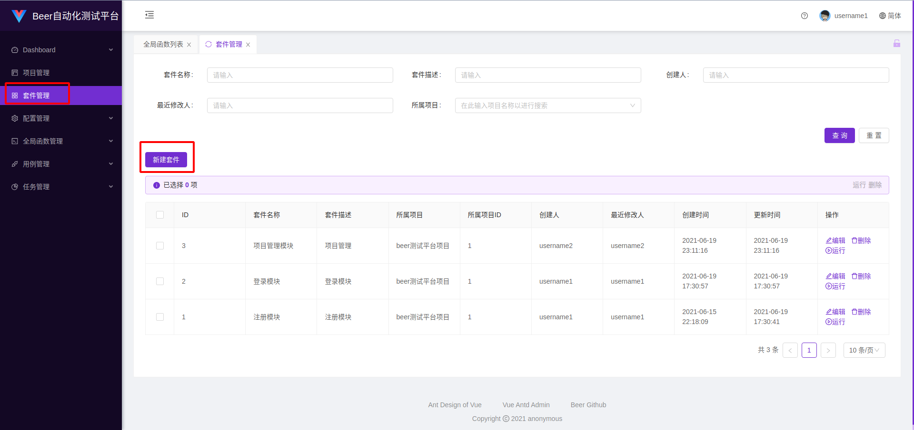
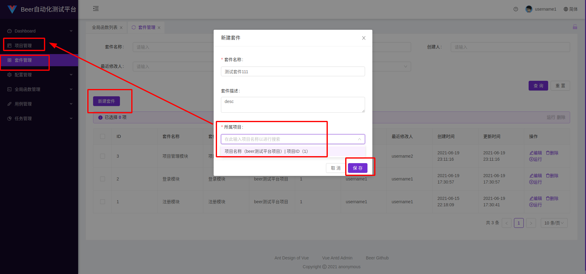
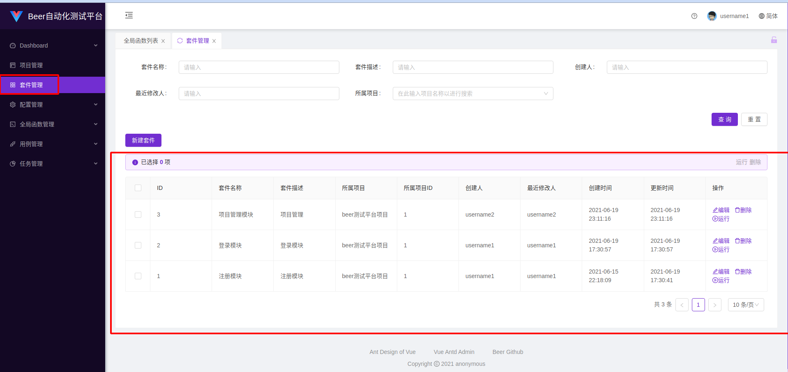
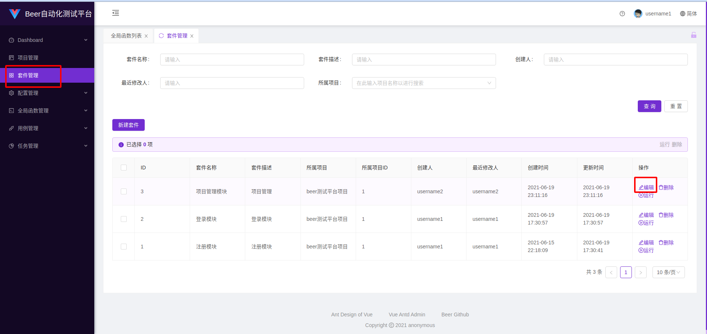
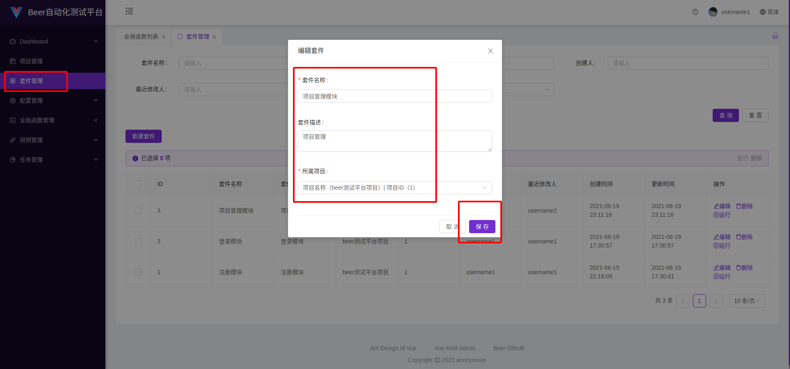
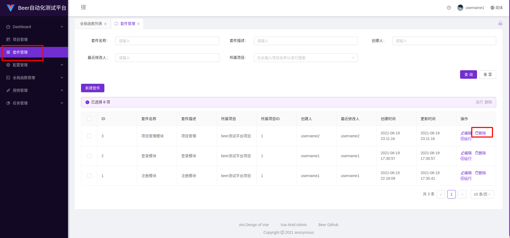
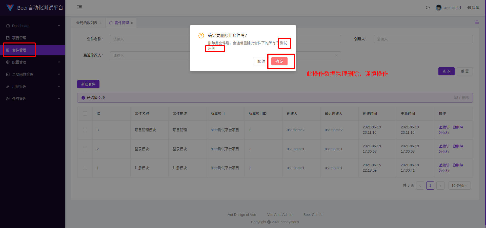
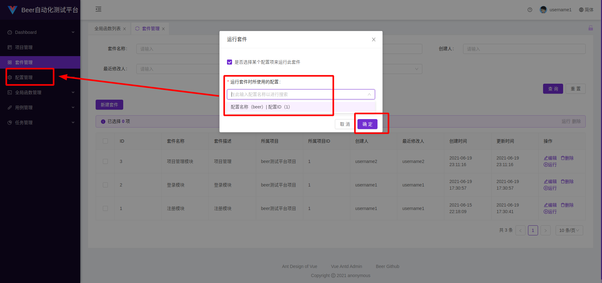
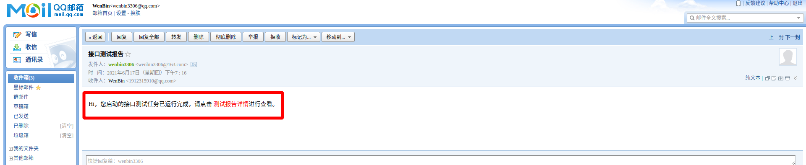

# 套件管理
## 图片看不清楚可以右键在新标签页打开图片就可以看清楚了
## 新增套件

## 查看套件

因为测试套件字段较少，所以在测试套件列表中就可以查看到所有的测试套件信息。

### 编辑测试套件

## 删除测试套件

## 运行测试套件

运行测试套件会运行测试套件下所有的测试用例，该操作数据异步操作，用户发起运行测试套件任务后，后台会开始执行该异步任务，等待测试套件内的所有测试用例运行完毕后，会自动给任务发起者的邮箱发送任务运行完毕通知，在邮件中可以查看具体的测试报告。

### 邮件通知

