# 用户与权限

## 用户管理

本系统中拥有`超级管理员`和`普通用户`这两种角色

### 超级管理员

超级管理员刚创建后，默认是无任何数据权限的，需要手动登录Django admin后台手动分配权限(超级管理员可以在admin后台为自己手动分配权限，普通用户默认无法登录admin后台)，建议为超级管理员分配所有数据权限。

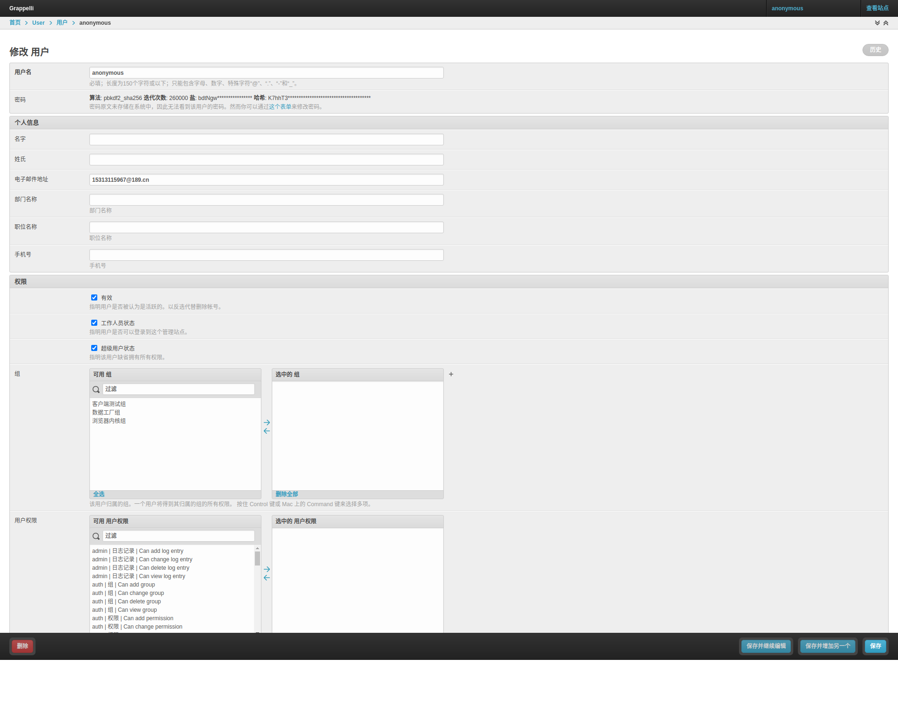

分配权限后，`超级管理员`就拥有了所有数据(`用户管理`，`用户组管理`，`权限管理`，`配置管理`，`全局函数管理`，`项目管理`，`套件管理`，`用例管理`，`测试任务管理`)权限(增删改查)。

#### 超级管理员创建方式

1. 超级管理员可通过部署项目时在配置文件`config.ini`中指定，当项目部署时会自动创建配置文件中指定的超级管理员账户。

   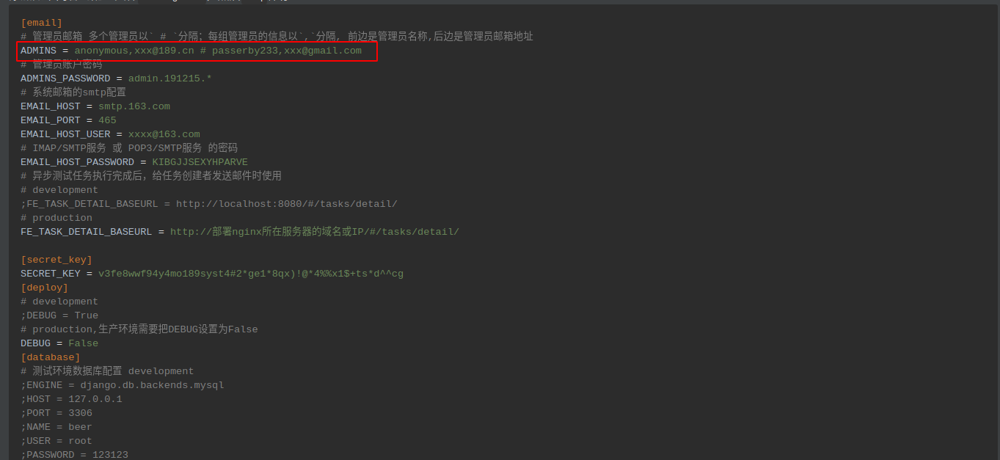

2. 通过`Django`项目自带的命令`python3 manage.py createsuperuser`进行创建。

   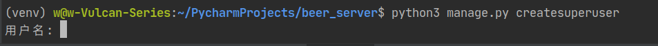

### 普通用户

普通用户的权限需要超级管理员再Django后台进行权限分配。默认刚创建的普通用户无任何数据权限。

#### 普通用户创建方式

1. 通过项目前端界面`http://域名或IP/#/login`页面自行进行注册。

   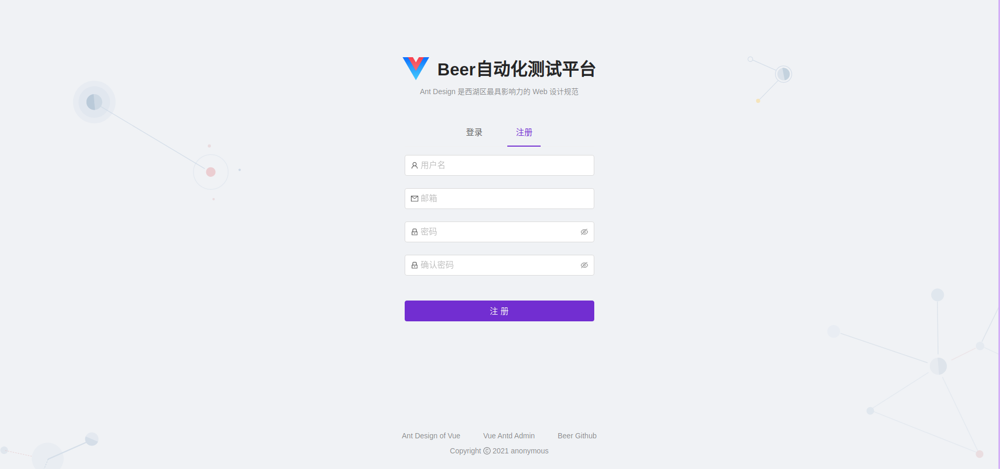

2. 在Django后台页面通过超级管理员手动创建普通用户。

   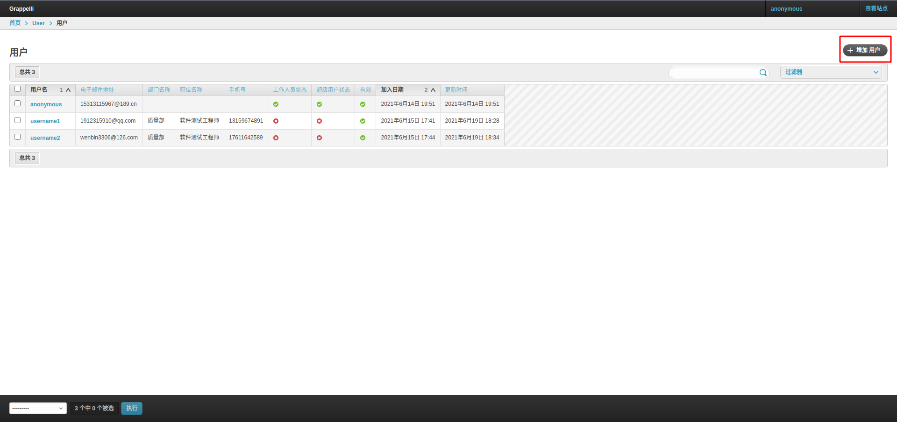

## 权限管理

### 为普通用户分配权限

1. 登录djang admin后台，点击用户管理，为每个用户分配权限即可。这种分配权限的方式很麻烦，可以借助django自带的RBAC权限管理来为每个普通用户分配权限更方便，具体见第2点。

   

   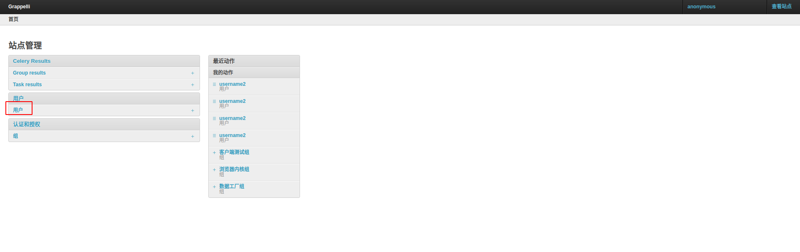

   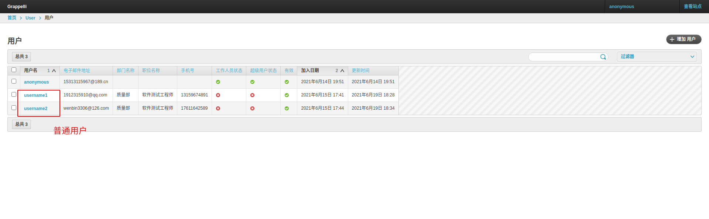

   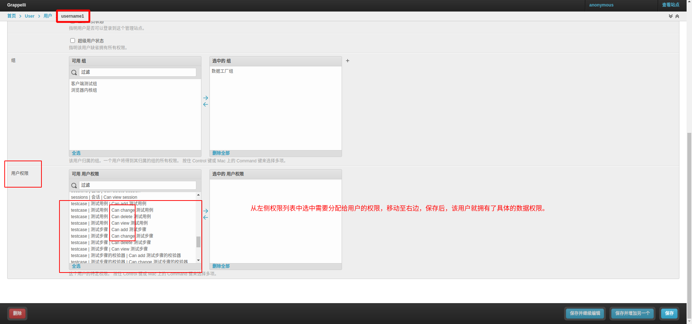

2. 通过先创建用户组，然后为用户组分配数据权限，然后再创建用户，然后再为每个用户分配组，这样的话每个用户就继承了该用户所在组的数据权限。(推荐)

   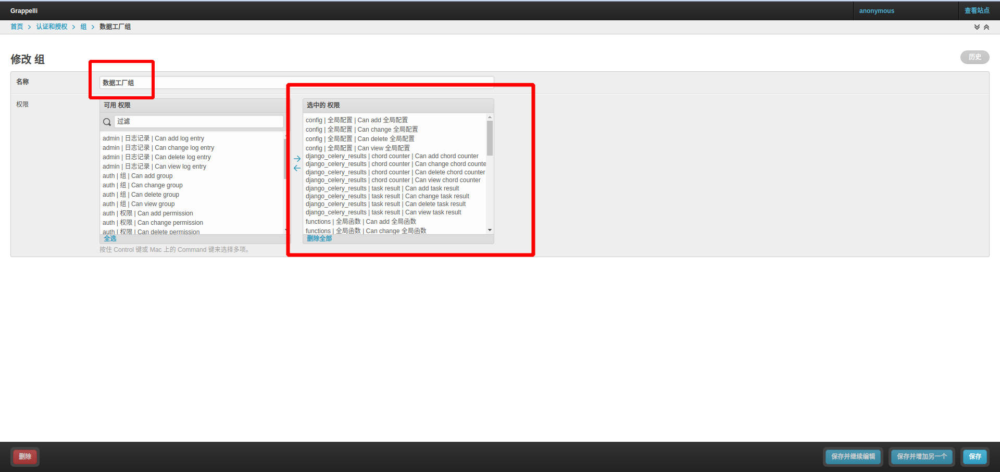

   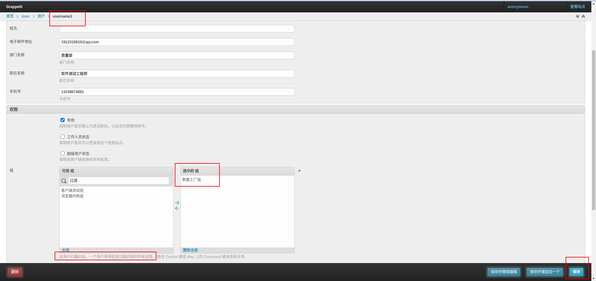

### 团队协作，以用户组为单位，为用户创建的数据做数据隔离

当前系统中的数据默认是以用户组为单位进行数据隔离的。只有在同一个用户组的用户才能互相看到自己包括当前组内其他成员的数据。

#### 示例说明

用户username1和username2都在同一个用户组中，所以在测试平台前台页面他们能互相看到自己包括对方的数据。

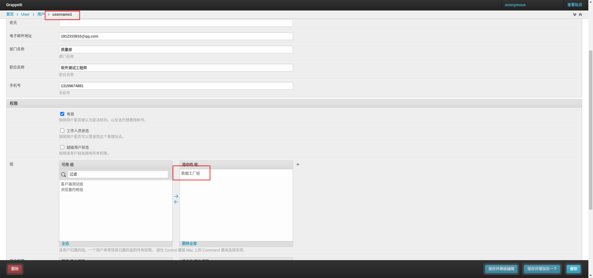

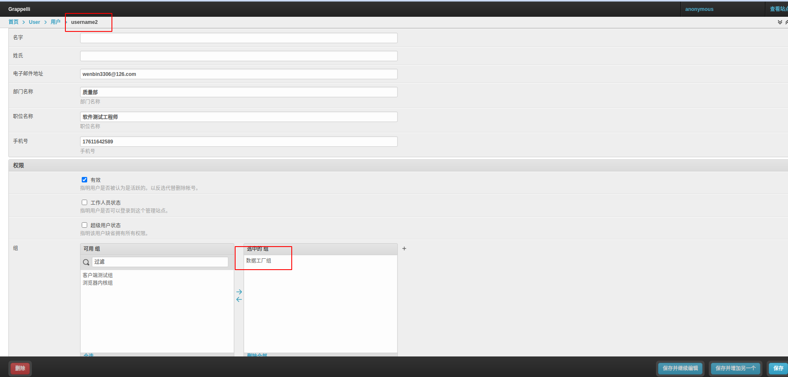

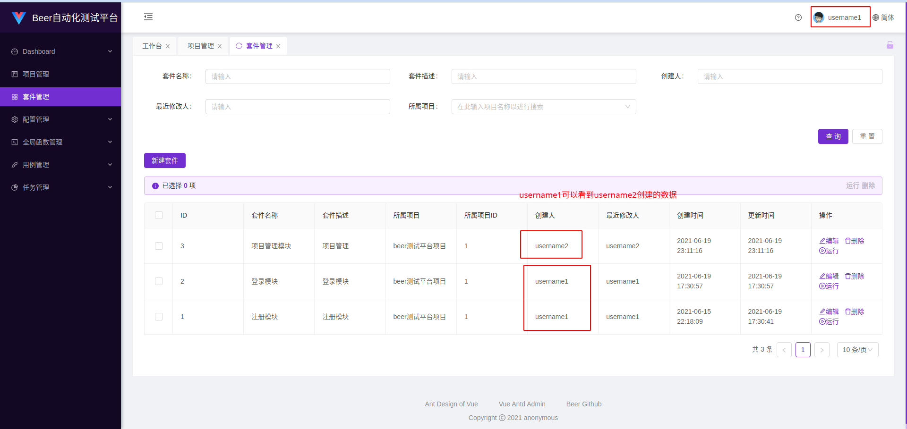

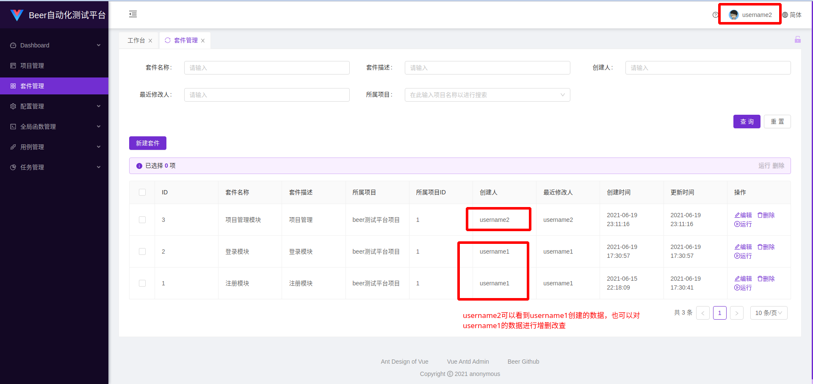

同一个用户组的用户，可以对该用户组内所有的用户创建的数据进行增删改查。

不在同一个用户组的用户，不能互相对对方的数据进行增删改查。如下所示

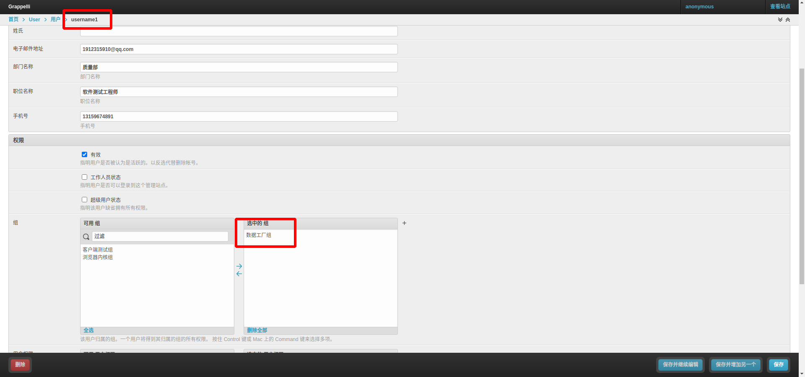

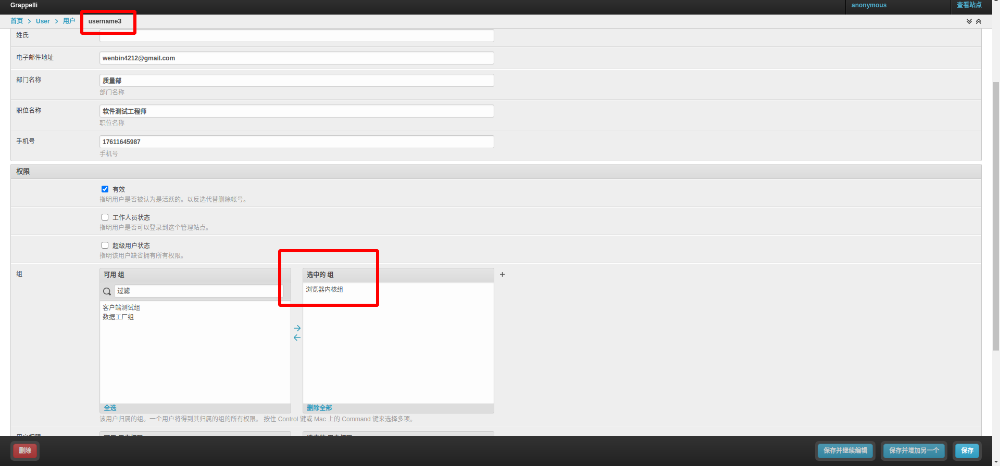

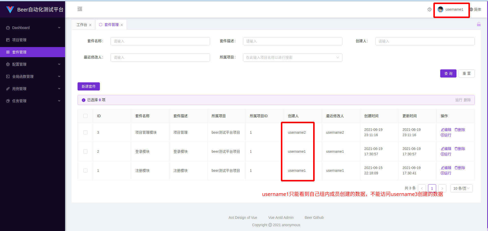

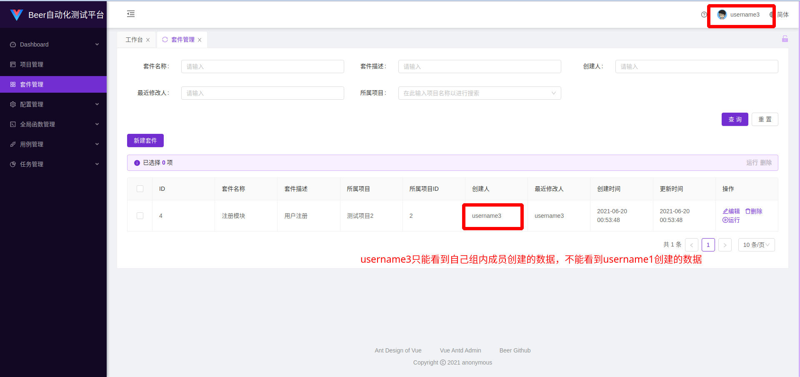

